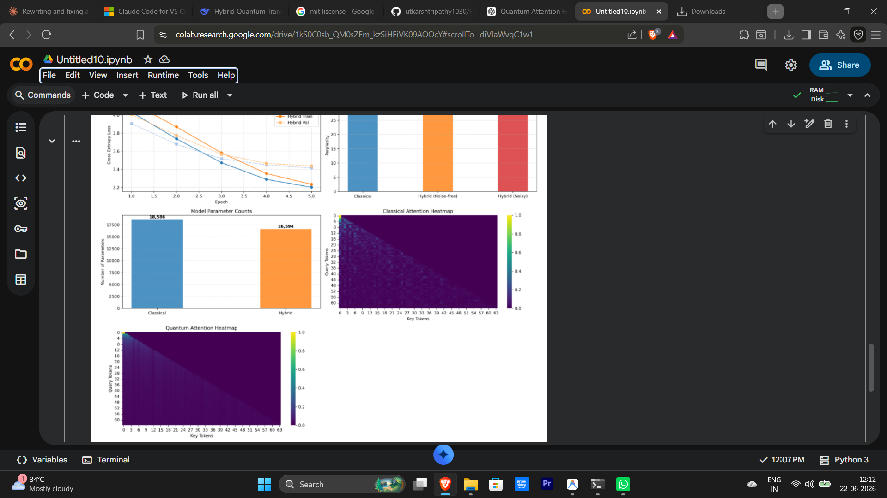
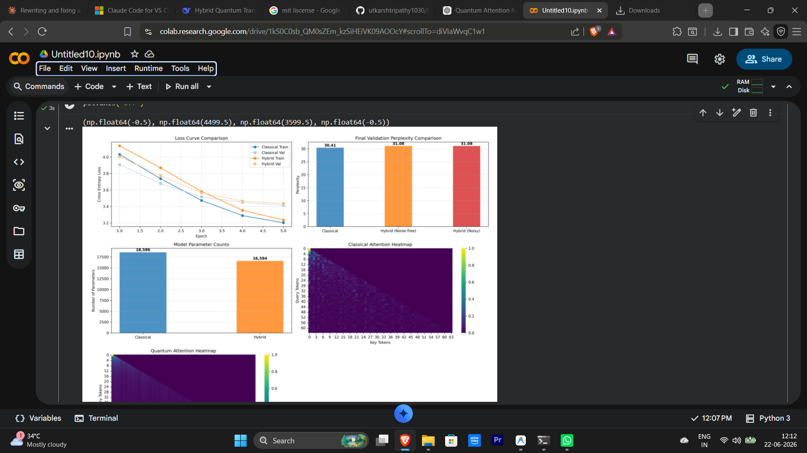

# Hybrid Quantum Transformer

**Design and Simulation of a Hybrid Quantum Self-Attention Layer for Small-Scale Language Modeling**

A research-oriented implementation of a Hybrid Quantum Self-Attention mechanism that combines classical Transformer architectures with parameterized quantum circuits. This work investigates the feasibility of quantum-enhanced attention mechanisms for sequence modeling tasks and explores the integration of Quantum Machine Learning with modern deep learning frameworks.

---

# Overview

Traditional Transformers rely entirely on classical computation. In this project, part of the attention mechanism is replaced by a **Parameterized Quantum Circuit (PQC)** implemented using PennyLane, creating a hybrid quantum-classical architecture.

The objective is not to outperform classical Transformers, but to investigate the behavior, efficiency, and practicality of quantum-enhanced attention mechanisms for small-scale language modeling.

### Research Objectives

* Explore quantum-enhanced feature representations.
* Develop hybrid quantum-classical attention mechanisms.
* Study the feasibility of Quantum Transformers on NISQ devices.
* Benchmark hybrid models against classical Transformer baselines.
* Evaluate language modeling performance for sequence lengths of 64–256 tokens.

---

# Architecture

```text
Input Tokens
      ↓
Embedding Layer
      ↓
Hybrid Quantum Self-Attention
 ├── Angle Encoding
 ├── Parameterized Quantum Circuit
 └── Measurement → Attention Representation
      ↓
Feed Forward Network
      ↓
Output Layer
```

---

# Key Features

* Hybrid Quantum Self-Attention integrated with PyTorch via PennyLane.
* Trainable 4-qubit variational quantum circuit.
* Classical embedding and feed-forward layers preserving Transformer structure.
* End-to-end differentiable training.
* Benchmarking framework for comparative analysis.
* Noise robustness evaluation.
* Modular and research-oriented implementation.

---

# Technology Stack

| Component                | Library    |
| ------------------------ | ---------- |
| Deep Learning            | PyTorch    |
| Quantum Machine Learning | PennyLane  |
| Numerical Computing      | NumPy      |
| Visualization            | Matplotlib |

---

# Installation

Clone the repository:

```bash
git clone https://github.com/utkarshtripathy1030/Hybrid-Quantum-Transformer.git

cd Hybrid-Quantum-Transformer
```

Install dependencies:

```bash
pip install -r requirements.txt
```

Or install manually:

```bash
pip install torch torchvision torchaudio
pip install pennylane
pip install numpy matplotlib
```

Verify PennyLane installation:

```python
import pennylane as qml

dev = qml.device("default.qubit", wires=4)

print(dev)
```

Expected output:

```text
<default.qubit device (wires=4)>
```

---

# Reproducing Results

Run:

```bash
python train_and_benchmark.py
```

The script automatically:

1. Tests the quantum circuit.
2. Tests the PyTorch-wrapped quantum layer.
3. Trains the Classical Transformer baseline.
4. Trains the Hybrid Quantum Transformer.
5. Computes validation loss and perplexity.
6. Evaluates noise robustness.
7. Generates benchmark visualizations.

---

# Benchmark Results

The benchmark pipeline automatically generates result plots.



---

# Example Google Colab Execution

The following screenshot shows the benchmark pipeline executing successfully in Google Colab.



---

# Usage

```bash
python train_and_benchmark.py
```

---

# Project Structure

```text
Hybrid-Quantum-Transformer/
│
├── classical_transformer.py
├── quantum_attention.py
├── hybrid_transformer.py
├── train_and_benchmark.py
├── data/
│   └── input.txt
├── Results/
│   ├── colab_benchmark_execution.png
│   ├── colab_benchmark_execution2.png
│   └── Result_Comparision.ipynb
├── requirements.txt
├── README.md
└── LICENSE
```

---

# Experimental Configuration

* Qubits: 4
* Quantum Framework: PennyLane
* Deep Learning Framework: PyTorch
* Task: Character-Level Language Modeling
* Optimizer: Adam
* Loss Function: Cross Entropy
* Device: CPU
* Epochs: 5

---

# Current Status

✅ Classical Transformer baseline implemented

✅ Hybrid Quantum Self-Attention layer integrated with PyTorch

✅ Parameterized quantum circuit implemented using PennyLane

✅ Benchmarking framework completed

✅ Noise robustness evaluation performed

🚧 Attention heatmap visualization and extended experiments are ongoing

---

# Research Objective

Design and simulate a hybrid quantum self-attention layer for small-scale language modeling and evaluate its effectiveness relative to classical attention mechanisms.

---

# Future Work

* Multi-head quantum attention mechanisms.
* Quantum positional encodings.
* Larger sequence lengths.
* Latency and scalability analysis.
* Comprehensive benchmarking against classical Transformers.
* Attention heatmap visualization.
* Deployment on real quantum hardware.

---

# Author

**Utkarsh Tripathy**

GitHub: https://github.com/utkarshtripathy1030

---

# License


---

# Citation

```bibtex
@misc{tripathy2026hybridquantumtransformer,
  author = {Utkarsh Tripathy},
  title = {Hybrid Quantum Transformer},
  year = {2026},
  url = {https://github.com/utkarshtripathy1030/Hybrid-Quantum-Transformer}
}
```
